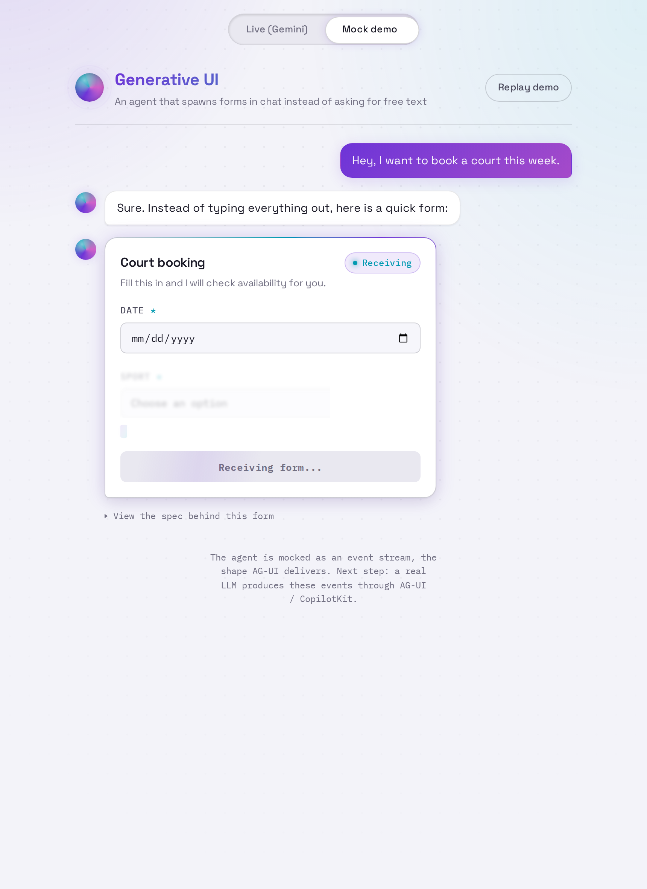
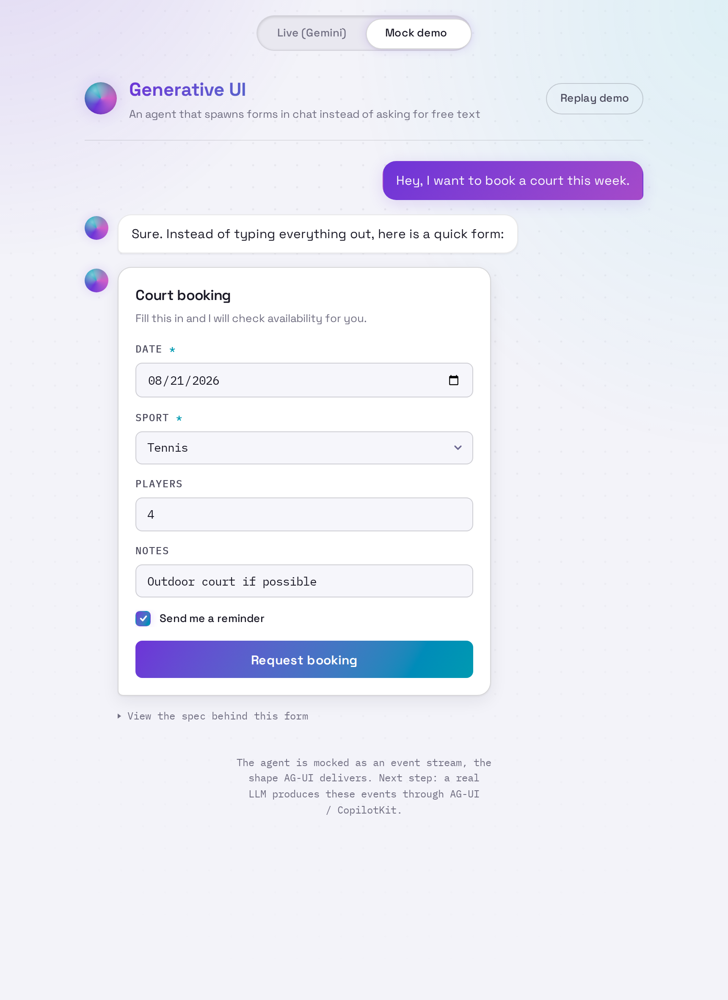
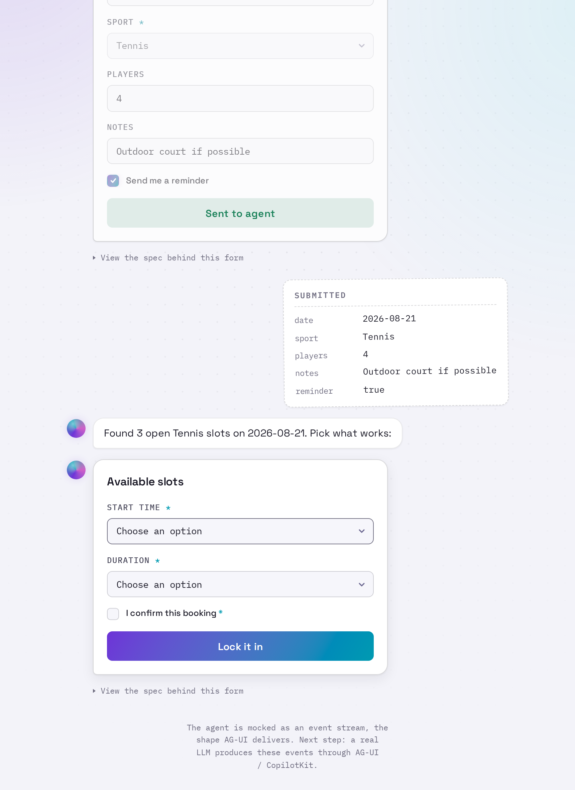
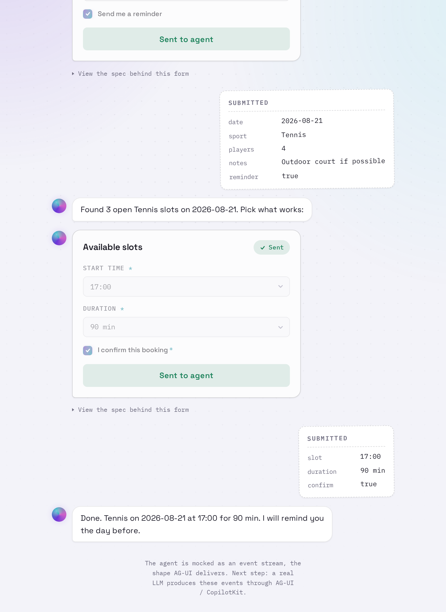

# generative-ui

Proof of concept for generative UI in chat agents: an agent spawns temporary,
interactive UI forms inside the chat to collect structured input from the user,
instead of asking for it as free text. The collected values flow back to the agent.

Built with React, Vite and TypeScript. The agent is currently mocked; the next
step wires it to a real LLM through the AG-UI protocol and CopilotKit.

## Demo


The user asks to book a court; instead of asking for the details in prose, the
agent *draws a form* in the chat. The user fills it, the values flow back, and
the agent generates the next form (time slots tailored to those values) from
them, until the booking is confirmed.

<table>
<tr>
<td width="50%"><br><sub><b>1. The form materializes</b> — fields stream in one by one, straight from the agent.</sub></td>
<td width="50%"><br><sub><b>2. It accepts input</b> — a real, validated form living inside the message.</sub></td>
</tr>
<tr>
<td width="50%"><br><sub><b>3. Forms become a dialogue</b> — submitted values flow back and drive the next form.</sub></td>
<td width="50%"><br><sub><b>4. The loop closes</b> — the agent confirms in plain text.</sub></td>
</tr>
</table>

<sub>Assets are generated from the offline Mock demo (no API key) by
<a href="docs/record-demo.cjs">docs/record-demo.cjs</a>.</sub>

## How it works

- `src/uiSpec.ts` defines the contract: a `FormSpec` JSON shape the agent uses
  to describe a form. `parseFormField` validates each field line on its own
  (specs stream JSONL style, one field at a time) and `parseFormSpec` validates
  whole specs. Errors are precise enough to feed back to the agent for a retry.
- `src/mockAgent.ts` simulates the agent as an event stream, the shape AG-UI
  actually delivers: typing, text, then a form that arrives field by field.
  Swapping it for a real LLM behind AG-UI only changes the event source.
- `src/AdHocForm.tsx` renders a spec as a live form, growing while it streams.
  Submitting freezes it into a read-only receipt, so the conversation moves
  forward and the past stays immutable.
- `src/App.tsx` drives a multi-turn conversation: a booking request produces a
  form, the submitted values make the agent generate a second form (time slots
  tailored to those values), and confirming closes the loop. Each form has a
  "view spec" toggle showing the JSON behind it.

## Background

- https://www.copilotkit.ai/ag-ui-and-a2ui
- https://docs.ag-ui.com/introduction
- https://docs.ag-ui.com/concepts/generative-ui-specs
- https://docs.ag-ui.com/agentic-protocols

## Run

```console
pnpm install
cp .env.example .env   # add your Gemini key (free at https://aistudio.google.com)
pnpm dev:server        # terminal 1: CopilotKit runtime backed by Gemini
pnpm dev               # terminal 2: the app
```

Then open the printed local URL (default http://localhost:5173).

Two modes, same rendering pipeline:

- **Live (Gemini)**: chat freely; when the model wants structured input it
  calls the `show_form` tool with a FormSpec JSON, which is validated and
  drawn in the chat. Invalid specs are bounced back to the model with the
  exact error so it can retry.
- **Mock demo**: a scripted agent that streams the same kind of specs
  offline, no key needed.

## Scripts

- `pnpm dev` starts the frontend dev server.
- `pnpm dev:server` starts the runtime (reads `GEMINI_API_KEY` from `.env`).
- `pnpm build` type-checks and builds for production.
- `pnpm check` type-checks only.
