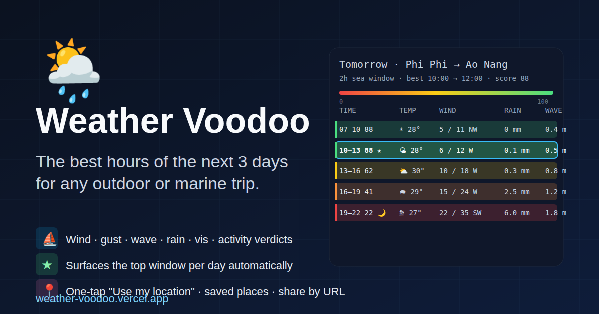
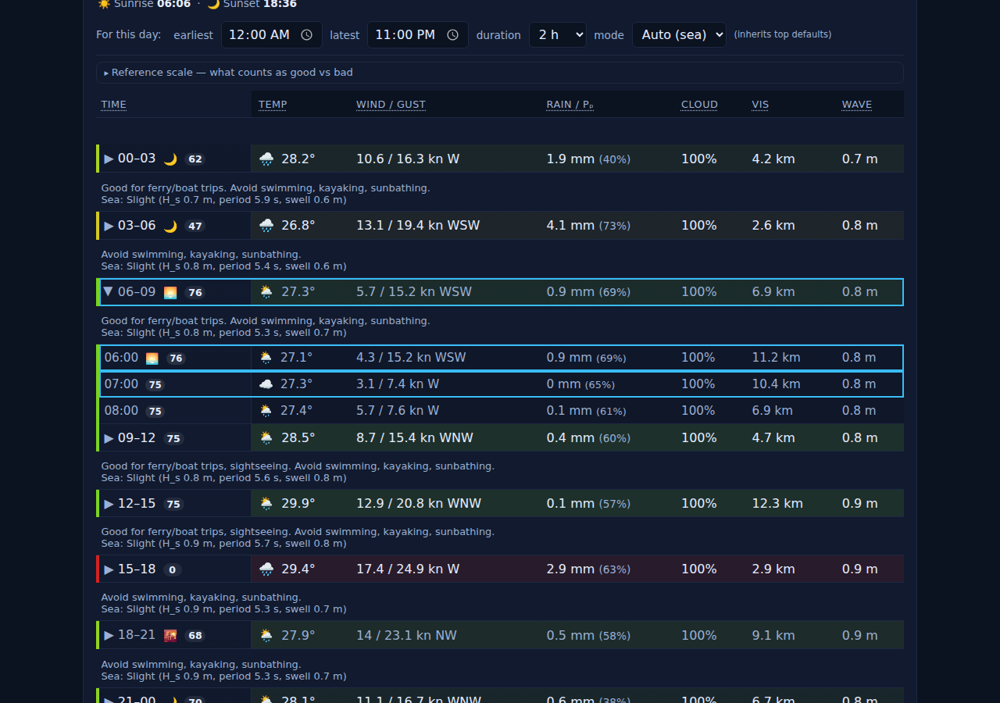
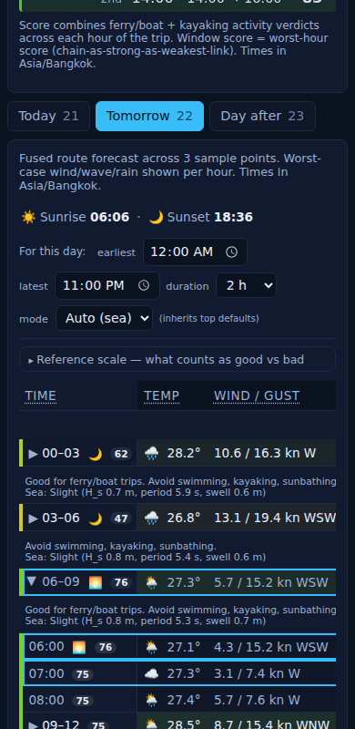

# Weather Voodoo — sharing kit

A one-page pitch you can paste into chats or hand to friends. Live app:
**https://weather-voodoo.vercel.app**

---

## What it does (in 30 seconds)

Picks the **best hours of the next 3 days** for a specific outdoor or marine
trip. Wind, gust, rain, wave height and visibility get blended into a single
**0–100 score** and the best contiguous windows are surfaced for you, per
day and overall.

Two modes:

- **Route** — pick a From and a To. Forecast is fused across 3 sample
  points along the line, taking the worst-case conditions hour-by-hour.
  Good for ferry/boat trips, kayak crossings, drives.
- **Fixed location** — one place. Good for a beach day, hike, sunset
  session.

Each row in the table is colour-coded by score, with the activity verdicts
("Good for ferry/boat trips. Avoid swimming, kayaking.") inline below.
Night hours are tinted darker; the time cell shows 🌅 / 🌇 markers on
the sunrise/sunset hours.

---

## Paste-ready demo links

- **Default landing page** — https://weather-voodoo.vercel.app
- **Phi Phi → Ao Nang, sea trip** —
  https://weather-voodoo.vercel.app/#f=7.7388,98.7784&fl=Phi+Phi&o=8.034,98.825&ol=Ao+Nang
- **Ao Nang, fixed location, land mode** —
  https://weather-voodoo.vercel.app/#t=fixed&a=8.034,98.825&al=Ao+Nang&md=land
- **Help / how to use it** — https://weather-voodoo.vercel.app/help

---

## Pitch you can copy into a message

> Found this — picks the best hours of the next 3 days for any outdoor or
> marine trip (ferry, kayak, hike, beach day). You give it a place or a
> route, it scores every hour 0–100 and tells you the best windows per day.
>
> https://weather-voodoo.vercel.app

Shorter:

> 🌦️ Best weather windows for the next 3 days, by hour, for any place or
> route. https://weather-voodoo.vercel.app

---

## Short demo video

Direct link (~1.8 MB MP4, generated with Gemini using the prompt below):
**https://weather-voodoo.vercel.app/promo.mp4**

Attach it to posts, embed it, or use it as the auto-playing media in
platforms that support it (Twitter, Discord, Telegram).

---

## Screenshots

Desktop (Route view, Tomorrow tab):

Mobile (sticky header, score-coloured rows):

---

## Install on your phone

It's a PWA — works offline after first load.

- **iOS Safari**: Share → *Add to Home Screen*.
- **Android Chrome**: ⋮ menu → *Install app*.
- **Desktop Chrome / Edge**: install icon in the address bar.

---

## Prompts for Gemini (image + video)

If you want a higher-fidelity hero image or a short demo video to attach to
posts, here are prompts you can hand to Gemini (or any text-to-image /
text-to-video model).

### Image prompt (single hero)

> A hero image, 16:9 aspect ratio, for a web app called **Weather Voodoo**.
> Theme: dark navy (#0b1220) background with a subtle map-grid texture in
> faint cyan. On the left, a stylised animated weather glyph (sun emerging
> from a cloud with a few rain drops) in soft pastel colours. To the right,
> a tilted glassy "card" floating in space showing a small mock forecast
> table: 5 horizontal rows colour-coded from green (good) → yellow → orange
> → red, each row showing a time range, temperature, wind, rain, wave
> height in a clean monospace font. One row is highlighted with a glowing
> cyan border and a small ★ icon labelled "best window 10:00 → 12:00,
> score 88". Overlaid title in bold white sans-serif: **"Weather Voodoo"**;
> subtitle below in a softer grey: **"The best hours of the next 3 days
> for any outdoor or marine trip."** Bottom-right corner watermark:
> "weather-voodoo.vercel.app". Modern, minimal, slightly futuristic, no
> photographic clutter, no stock photo people.

### Video prompt (5–8 seconds)

> A 5–8 second loop, 16:9, dark navy theme matching the hero image. Open
> on a stylised world map made of faint cyan grid lines; a glowing pin
> drops on a coastal location with a soft splash of light. Cut to a
> floating glassy card showing a 3-day hourly forecast table; the rows
> animate in from bottom one by one, each tinting from green → yellow →
> orange → red based on conditions. A cyan rectangle slides across the
> table and snaps onto the highest-scoring 2-hour window, with a small ★
> burst and the label "best window: 10:00 → 12:00 · 88/100" fading in.
> Hold the highlighted window for a beat, then a final title card:
> **"Weather Voodoo — best hours, next 3 days"** with
> "weather-voodoo.vercel.app" in a softer grey beneath. Smooth, calm,
> data-app aesthetic — no people, no music suggestions, no logos other
> than the title.

Tip: if Gemini hesitates on "Weather Voodoo" as a brand name, append:
*"This is the name of a personal hobby project; render it as plain
typography, not as a real-world logo."*

---

*Regenerate the OG card after any visual change with:*
`node /tmp/pw-debug/rasterize-og.mjs` *(if the helper is around) or commit
a fresh `static/og.png` by hand.*
