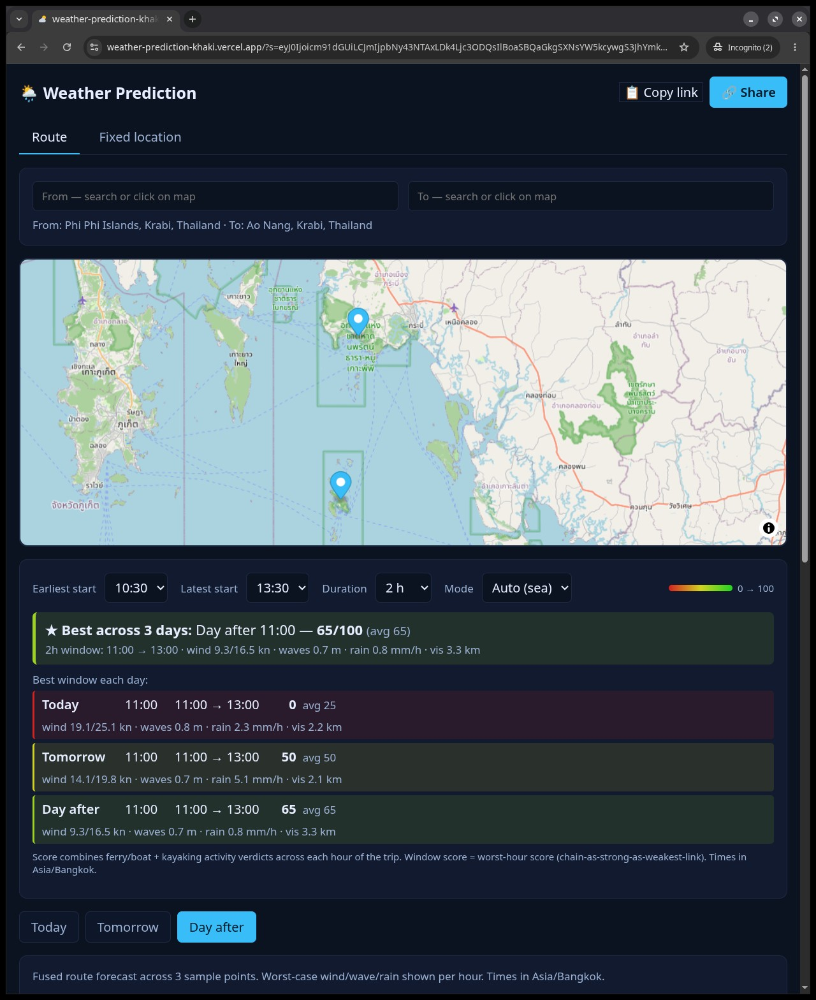
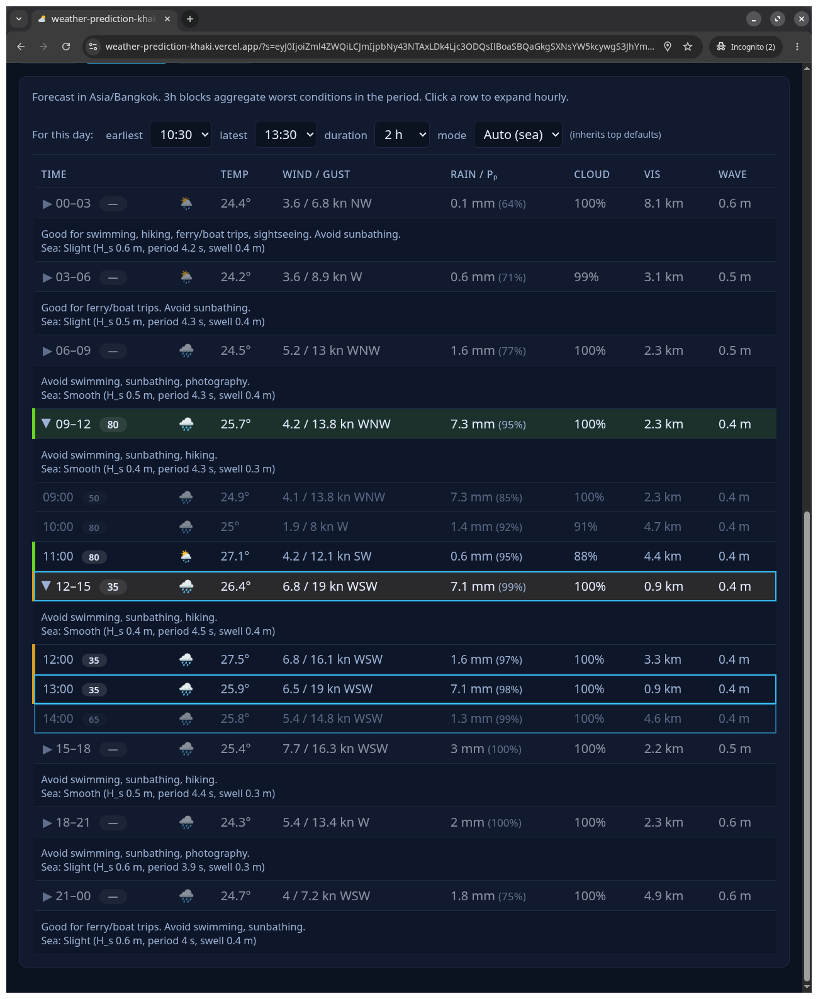
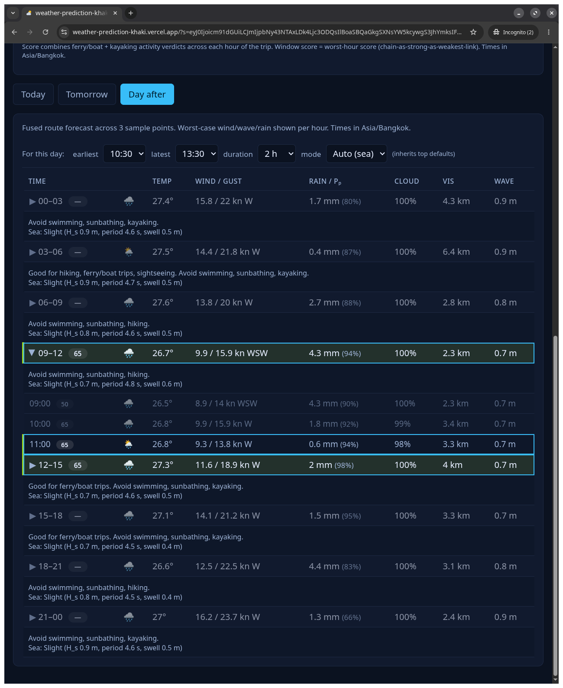
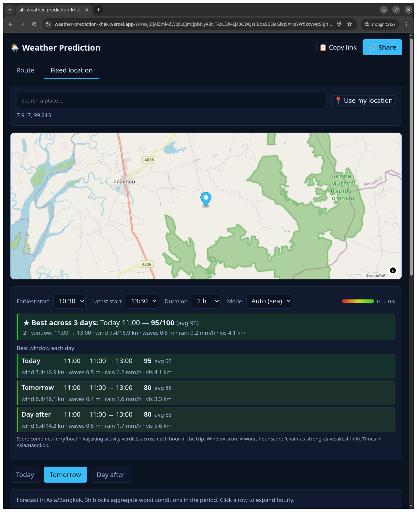

# Weather Voodoo

A SvelteKit webapp that gives hour-by-hour fused weather forecasts for a **route** (e.g. a ferry crossing) or a **fixed location**, ranks the best time windows to travel by trip duration, and produces shareable URLs that reproduce the exact view.

🌐 **Live**: [weather-voodoo.vercel.app](https://weather-voodoo.vercel.app) (legacy alias: [weather-prediction-khaki.vercel.app](https://weather-prediction-khaki.vercel.app))


---

## Screenshots

**Route tab — Phi Phi → Ao Nang, trip finder showing best window across 3 days:**



**Forecast table with 3h blocks expanded into hourly rows — each hour shows the trip-window score chip and red→green gradient:**

| Today | Day after |
|---|---|
|  |  |

**Fixed-location tab — inland point auto-falls-back to land mode:**



---

## What it does

### Two tabs

| Tab | Purpose |
|---|---|
| **Route** | Pick a "from" + "to" — the app samples three points along the line, fetches forecast + marine data for each, and **fuses** them as worst-case-along-route (max wind, max wave, max rain, min visibility). Use for planning a sea crossing or a road trip. |
| **Fixed location** | Single point — search a place or use browser geolocation. Frame is "trip outside" / activity planning. |

Both tabs work for today, tomorrow, and the day after.

### Trip-window finder

Above the forecast table on both tabs, a card lets you pick:

- **Earliest start** + **Latest start** (00:00 – 23:30 in 30-min steps)
- **Duration** (1, 2, 3, 4, 6, 8 or 12 hours)
- **Mode** — `Auto` (sea/land auto-detected from marine-data availability), or force `Sea` / `Land`

For every hour where you could start, the app computes a **window score 0–100** = worst hour score across the trip's duration (chain-as-strong-as-weakest-link). The card then shows:

1. **★ Best across 3 days** — the overall best start window with conditions summary
2. **Best window each day** — one row per day (Today / Tomorrow / Day after) so all 3 days are always visible

Click any window → the table jumps to the matching day, expands the relevant 3h slot, scrolls the matched hour into view, and outlines it in sky-blue. Subsequent clicks on other panel options re-target the highlight.

### Per-day overrides

Inside each day tab, a "for this day" bar has its own Earliest / Latest / Duration / Mode pickers. They default to the top-level values; any change becomes a per-day override (a single **↻ reset** clears all four overrides at once). The trip-finder's per-day rows respect these — they show a small badge like `4h · sea` when that day's config diverges from the top.

### Score per hour

The forecast table has a **0–100 score chip next to every time label**, plus a continuous **red→green HSL gradient** on the row background matching the score:

- **3h aggregate row** — score = max of in-window hour scores (best startable hour in the block)
- **Expanded hourly row** — score = window score if this hour is a valid start (worst hour over the next N hours), or this hour's own conditions score if it's covered by the latest trip but isn't a valid start

The table colors every hour from `Earliest` through `Latest + Duration` — i.e. every hour the trip could span, not only valid start hours. Hours that can't be a start time but are still covered by some trip show their own conditions score with a clarifying tooltip. Hours completely outside any valid trip are dimmed to 50% opacity.

### Activity verdicts

Every 3h block has a "Good for X. Avoid Y." line. Rules are declarative thresholds over wind / gust / rain / wave / visibility / temp / UV / cloud cover. Verdicts: `good | ok | poor | unsafe`.

| Activity | Key thresholds |
|---|---|
| swimming | tempC ≥ 23 + windKn < 12 + dry → good. waveHs > 0.8 or tempC < 16 → unsafe. |
| sunbathing | cloud < 40% + dry + tempC ≥ 22 → good. UV ≥ 9 → poor. |
| hiking | rain < 0.5 mm/h + wind < 18 kn + vis > 5 km + temperate → good. |
| kayaking | waveHs < 0.5 + wind < 12 kn → good. waveHs > 1 or gust > 22 → unsafe. |
| ferry / boat | waveHs < 1 + gust < 22 + vis > 3 → good. waveHs > 2.5 or gust > 35 → unsafe. |
| photography | vis > 10 km + cloud in [20, 70] → good. |
| sightseeing | rain < 0.5 + wind < 18 → good. |

Thresholds documented inline in `src/lib/activities.ts`. The **sea** trip-score combines `ferryOrBoat + kayaking`; the **land** trip-score combines `sightseeing + hiking + photography`.

### Share links

Click **Share** in the header → copies the current URL via Clipboard API (or invokes `navigator.share()` on mobile). The URL is a single base64-encoded JSON blob:

```
https://weather-voodoo.vercel.app/?s=eyJ0IjoicgZ2c…
```

It captures **every** input: tab, from / to / at locations, day, expanded 3h slots, earliest/latest/duration/mode (top + per-day overrides), and the highlighted window. Opening the link in a fresh tab restores the exact view.

Legacy `?tab=route&from=lat,lon&to=lat,lon` URLs from earlier versions still resolve (basic fields only) for backward compat.

### Map

- **MapLibre GL JS + OpenStreetMap** — always loaded, no key required
- **Google Places autocomplete** — used for place search when `PUBLIC_GOOGLE_MAPS_API_KEY` is set; falls back to Open-Meteo's geocoding API otherwise
- Click anywhere on the map to drop a pin (first click = `from`, second = `to` on the route tab)

### Mobile-responsive

Breakpoints at 720px and 420px. Picker rows wrap, forecast table swipes horizontally, condition strings collapse on the smallest phones, place-search inputs use 16px font to prevent iOS auto-zoom.

---

## Data sources

| Source | Endpoint | Key required |
|---|---|---|
| Open-Meteo forecast | `api.open-meteo.com/v1/forecast` | ❌ no |
| Open-Meteo marine | `marine-api.open-meteo.com/v1/marine` | ❌ no |
| Open-Meteo geocoding | `geocoding-api.open-meteo.com/v1/search` | ❌ no |
| OpenWeather One Call | `api.openweathermap.org/data/3.0/onecall` | ✅ paid sub (One Call 3.0) |
| OpenWeather Air Pollution | `api.openweathermap.org/data/2.5/air_pollution` | ✅ free tier |
| Google Maps JS API | `maps.googleapis.com/maps/api/js` | ✅ free $200/mo credit |

Without any keys the app is fully functional (MapLibre + Open-Meteo only). OpenWeather contributes UV / AQI / weather-alerts; if its endpoint returns `{available: false, reason: …}` the corresponding panels just hide.

---

## Quickstart (local)

```bash
cd weather-voodoo
pnpm install
cp .env.example .env.local          # optional — see Environment variables below
pnpm dev                            # http://localhost:5173
```

### Other scripts

```bash
pnpm build      # production build (.svelte-kit + .vercel/output)
pnpm preview    # preview the production build at http://localhost:4173
pnpm check      # type-check (svelte-check + tsc)
pnpm test       # vitest — fusion, activities, url-state, geo, trip-score (45 tests)
```

---

## Environment variables

Create `weather-voodoo/.env.local` (it's in `.gitignore`):

```bash
# Required for OpenWeather UV / AQI / alerts. Server-side only.
OPENWEATHER_API_KEY=

# Optional. If empty, MapLibre + Open-Meteo geocoding take over.
# Public — restrict by HTTP referrer in Google Cloud Console.
PUBLIC_GOOGLE_MAPS_API_KEY=
```

### Provisioning the keys

**OpenWeather** — sign up at [openweathermap.org](https://openweathermap.org), generate a key. New keys take up to a couple of hours to activate (you'll see 401 "Invalid API key" until then). **One Call 3.0** needs a separate paid subscription on new accounts (the free tier is the older `/data/2.5/*` endpoints); if you don't subscribe, the `/api/owm` endpoint returns `{available: false}` and the UV / alerts panels in the Fixed-location tab silently hide.

**Google Maps** — create a project in the [Google Cloud Console](https://console.cloud.google.com/), enable **Maps JavaScript API** + **Places API**, create an API key, then **restrict by HTTP referrer** to:

- `http://localhost:5173/*`
- `https://*.vercel.app/*`
- `https://<your-prod-domain>/*`

Also set a **daily quota cap** in the Cloud Console (Maps gives ~$200/mo free credit; capping prevents surprises). The MapLibre fallback is always wired so you can steer traffic off Google by simply unsetting the variable.

---

## Deploy to Vercel

### One-time setup

```bash
pnpm install -g vercel               # if not already installed
cd weather-voodoo                    # ← important: deploy from inside this dir
vercel link                          # links to the Vercel project
vercel env add OPENWEATHER_API_KEY production   # paste the key when prompted
vercel env add PUBLIC_GOOGLE_MAPS_API_KEY production    # optional
```

### Deploy

```bash
cd weather-voodoo
vercel deploy --prod --yes           # builds + uploads + promotes to production
                                     # also updates the custom alias
```

The first deploy returns two URLs:

- **Per-deployment URL** like `https://weather-voodoo-<hash>-<scope>.vercel.app` — gated by Vercel Authentication by default (returns 401 for the public). Useful only for the project owner.
- **Production alias** like `https://weather-voodoo-<short>.vercel.app` — public; this is the one to share. The legacy `https://weather-prediction-khaki.vercel.app` URL is kept as an alias so old share links keep working.

After a preview deployment, add the preview URL to your Google Cloud API key's HTTP-referrer allowlist (otherwise the Maps script will be blocked client-side).

### `vercel.json`

Already in the repo. It attaches:

```
Cache-Control: public, s-maxage=600, stale-while-revalidate=3600
```

to every `/api/*` response so Vercel's edge cache absorbs repeated calls.

### Common pitfall

When running `vercel deploy`, your working directory matters. If you run it from the repo root (`/home/user/experimental`) you'll deploy a **different** Vercel project. Always `cd weather-voodoo` first — there's a `.vercel/project.json` there linking to the right project.

---

## Architecture

```
src/
├── app.css                              design tokens + responsive media queries
├── app.html                             SvelteKit shell
├── lib/
│   ├── types.ts                         LatLng, ForecastHour, MarineHour, FusedHour,
│   │                                    DayOverride, TripMode, Activity, Verdict, ViewState
│   ├── state.svelte.ts                  global $state view + effectiveConfig() + helpers
│   ├── url-state.ts                     ?s= base64-JSON encode/decode + legacy fallback
│   ├── time.ts units.ts geo.ts          helpers (TZ, kn/m/s, haversine, route sampling)
│   ├── fusion.ts                        per-hour max/min reducers, 3h aggregator
│   ├── activities.ts                    rule table + scoreHour() + summariseHour()
│   ├── trip-score.ts                    hourTripScore + windowScoreAt + findBestWindows
│   │                                    + detectMode + resolveMode + scoreToCss
│   ├── server/
│   │   ├── openmeteo.ts                 fetchForecast / fetchMarine / geocode
│   │   ├── openweather.ts               fetchOneCall / fetchAir (graceful 401)
│   │   ├── cache.ts                     LRU + SWR, lat/lon rounded to 3dp
│   │   └── env.ts                       openWeatherKey() reads $env/dynamic/private
│   ├── client/
│   │   ├── googleMaps.ts                idempotent script-tag loader for Places
│   │   └── geolocation.ts               Promise wrapper around navigator.geolocation
│   └── components/
│       ├── MapView.svelte               MapLibre + OSM, click-to-pin, polyline
│       ├── PlaceSearch.svelte           Google Places (if key) / Open-Meteo geocode
│       ├── Tabs.svelte DayTabs.svelte
│       ├── TripFinder.svelte            top-level 4-picker card + best windows
│       ├── ForecastTable.svelte         per-day controls + hourly score map + table
│       ├── ForecastRow.svelte           3h aggregate row + expansion
│       ├── HourCell.svelte              individual hour row + score chip + tint
│       ├── MarineBlock.svelte ActivityBadge.svelte ShareBar.svelte
│       └── icons/WxIcon.svelte          WMO weather code → emoji
└── routes/
    ├── +layout.svelte +layout.ts        URL ↔ view sync via goto + decodeView
    ├── +page.svelte                     tab switcher between Route / Fixed
    └── api/
        ├── forecast/+server.ts          GET ?lat&lon&days=3
        ├── marine/+server.ts            GET ?lat&lon&days=3
        ├── route/+server.ts             GET ?from=lat,lon&to=lat,lon&samples=3&days=3
        │                                fuses 3 sample points server-side
        ├── owm/+server.ts               GET ?lat&lon&kind=onecall|air (server-only key)
        └── geocode/+server.ts           GET ?q=…  (Open-Meteo geocoding proxy)
```

---

## Caching strategy

- **Server LRU** keyed by `endpoint + lat/lon rounded to 3dp + day window`, TTL 10 min, max 500 entries — fits Vercel function memory comfortably.
- **HTTP headers** `Cache-Control: public, s-maxage=600, stale-while-revalidate=3600` on every `/api/*` response → Vercel's edge cache absorbs repeated traffic globally.
- **Open-Meteo fair-use** (~10k calls/day per IP, non-commercial) is well within reach thanks to the above two layers.

---

## Risks & known limitations

| Topic | Note |
|---|---|
| Google Maps billing | Restrict key by HTTP referrer + set a daily quota cap in Cloud Console. The MapLibre fallback is wired so traffic can be steered off Maps quickly by unsetting the env var. |
| OpenWeather One Call 3.0 | Requires paid subscription on new accounts; the app degrades gracefully if 401/403 (hides UV / alerts blocks). Key takes ~2h to activate after generation. |
| Open-Meteo accuracy | Hourly data is solid through day +2; we hard-cap the UI there. Marine forecast accuracy drops sharply past day +3. |
| 30-min start granularity | Forecast data is hourly. A 30-min "Earliest start" tightens the bound (e.g. 08:30 = "must be 09:00 or later"). Same for latest. |
| Geolocation | Needs HTTPS. Works on Vercel and `localhost`; fails on LAN IPs without HTTPS. |
| Timezones | Times always shown in the *location's* local TZ (Open-Meteo `timezone` field). The `hl=` highlight ISO and 3h slot keys are interpreted in that TZ, so share links stay meaningful across senders. |

---

## End-to-end share-link round trip

The canonical test for "does my friend see what I see?":

1. Open the app, set Earliest = 09:00, Latest = 17:00, Duration = 4h
2. Click any panel option (e.g. "Best across 3 days")
3. URL updates to `?s=…`
4. Click **Share** → URL is copied
5. Paste in an incognito window → identical view: same day tab, same expanded slot, same highlighted hour, same pickers
